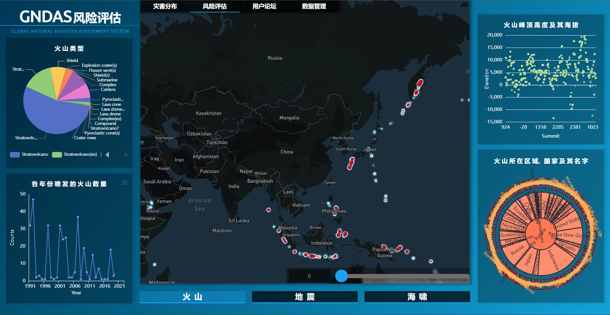
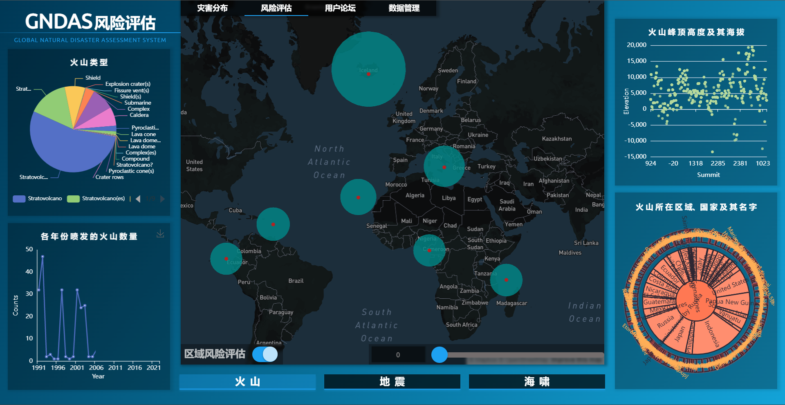

# 全球自然灾害评估系统 GNDAS

<div align="center"><font size=5>Global Natural Disaster Assessment System</font></div>

<div align="center"></div>

> <font size=3>[卫星](https://icons8.com/icon/xJRSLyEAA9bz/卫星) icon by [Icons8](https://icons8.com)</font>

<div align="center">   </div>

<div align="center">   </div>

全球自然灾害评估系统（GNDASystem）是一款基于Web端的自然灾害地理信息分析评估应用，是独具人文关怀的一项地理信息系统Web实现。

[TOC]

## 应用部署

> Linux 端

1. 克隆本项目

   ```bash
   git clone https://github.com/TwSphinx54/GNDAS.git
   ```

2. 在环境内安装依赖包

   ```bash
   pip install -r requirements.txt
   ```

3. 手动修改 html 文件内的 url 地址

   ```
   127.0.0.1:8080 → <target url>
   ```

4. 进入 `./GNDAS` ，部署网站并挂起到到后台运行（请注意开放服务器8080端口）

   ```bash
   nohup gunicorn -w 4 -b 127.0.0.1:8080 start:app &
   ```

## 应用卸载

```bash
rm -rf ./GNDAS
conda remove -n <gndas_env> --all --y
```

## 使用教程

**GNDAS系统**包含了四大功能模块：

> | 灾害分布 | 风险评估 | 用户论坛 | 数据管理 |
> | :------: | :------: | :------: | :------: |

请访问[demo](http://110.40.221.64/)以体验系统功能。

1. 进入系统首页，右侧三维实景地球可以进行交互。

   

2. 点击按钮开始登录，这个页面可以进行用户的登录或注册，后台会对用户信息进行核对，检查密码是否正确。值得注意的是，页面注册的用户仅有普通用户权限，不开放管理员用户的注册。

   

3. 登录或注册后进入系统主页面，显示灾害分布信息。该界面也是系统最主要的信息展示页面。

   

   * 右下角的控制台会展示当前的系统情况，包括登录用户的信息、系统收录的记录量、最近一次发生的灾害信息，以及当前时间。

   * 右上角的灾害预警使用了自研的预测算法，计算下一次最有可能发生灾害的时间地点。

   * 顶部是导航栏，控制页面间的跳转。

   * 左侧的控制面板是最主要的交互中心：

     * 灾害种类模块可以控制系统上的各项灾害的显示与否，用户可以自定义显示组合；

     * 更改地图模块可以调用 Mapbox API 对显示底图进行更改；

     * 实时位置模块显示鼠标位置处的现实地理坐标；

     * 遥感大数据可视化模块可以在地图上覆盖系统内置的大数据可视化图层；

       

     * 自然灾害检索模块可以根据用户输入的内容在后台数据库内进行模糊匹配，检索最相近的灾害。

       

       点击搜索结果或者单击系统上显示的灾害图标，可以定位到灾害发生地点查看其信息。

     * 定位到某个灾害点后，点击右上角的详细信息可以展示该灾害的详细信息以及三维实景，用户可以在此处对三维实景进行交互查看。

       

4. 进入风险评估模块，该模块对各个灾害进行了详尽多元的数据分析与评估，中心是阈值可调节的灾害发生地热力图，下方的按钮可以切换灾害种类，四周的表格都基于 ECharts 实现了交互式可视化。

   

   此外，系统还提供了基于聚类灾害中心的区域风险评估交互分析。

   

5. 进入用户论坛模块，用户可以在这里交流评论，该模块可以防御XSS攻击。

   

6. 进入数据管理模块，该模块只有管理员能够进入，可以在这里添加灾害记录，下载数据。

   

## 项目成员

[](https://github.com/TwSphinx54) [](https://github.com/MeloMeng) [](https://github.com/Sunshineeeeeee) [](https://github.com/xiaoyelulu)

